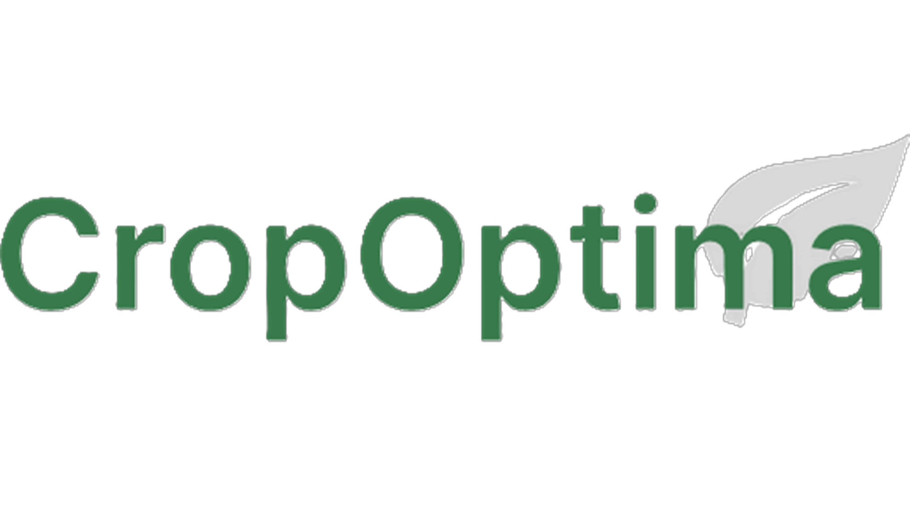
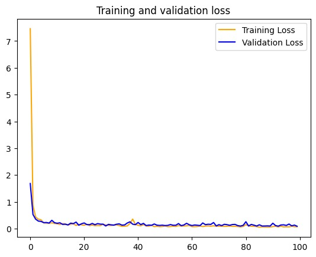
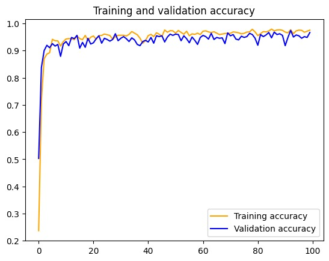
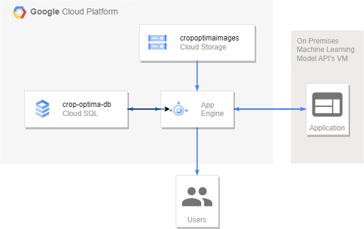
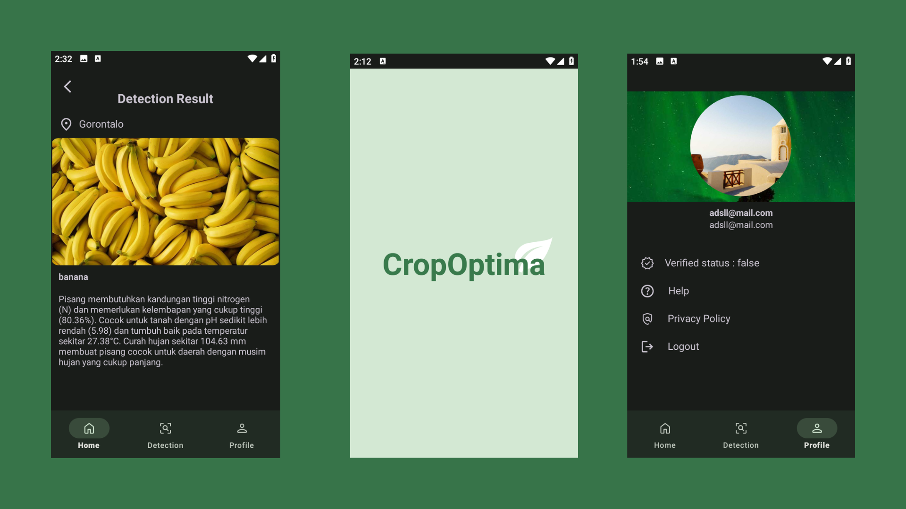

<br/>
<p align="center">
  <a href="https://github.com/panduwjaya/CropOptima-Fullteam/">
    
  </a>

  <h3 align="center">Crop Optima 🍃</h3>

  <p align="center">
    An Awesome application that can give you plant suggestion based on your location!
    <br/>
    <br/>
  </p>
</p>

  

## Table Of Contents

* [📑 About the Project](#-about-the-project)
* [👨‍💻 Authors](#-authors)
* [⚡️ Getting Started](#-getting-started)
    * [Machine Learning 🤖](#machine-learning-)
    * [Cloud Computing ☁️](#cloud-computing-)
    * [Mobile Development 📱](#mobile-development-)
* [🔥 Feature](#-feature)
* [⛓️ License](#-license)
* [🎮 Contributing](#-contributing)

## 📑 About The Project


We make a mobile application that can give plant sugestion based on your location na dyour enviroment situation, such as
Nitrogen, Fosfor, an Kalium. With that data we send it to out Machine Learning model and the model will give us the
suggestion plant as result. The model itself created by using dataset. Our mobile application do communication with the
Machine Learning Model via API which created by our personil too.

## 👨‍💻 Authors

|            Nama            | Bangkit-ID  |        Path        |
|:--------------------------:|:-----------:|:------------------:|
|      Odista Dwi Putra      | M226BSY1570 |  Machine Learning  |
| Prayogo Makarya Alexandria | M001BSY0200 |  Machine Learning  |
|      Devano Danendra       | M226BSY0749 |  Machine Learning  |
|  Alvin Reihansyah Makarim  | C248BSY3644 |  Cloud Computing   |
|        Muhkito Afif        | C248BSY3747 |  Cloud Computing   |
|        Pandu Wijaya        | A248BSY1976 | Mobile Development |
|  Muammar Mufid Darmindra   | A548BKY4474 | Mobile Development |

## ⚡️ Getting Started

This is an example of how you may give instructions on setting up your project locally.
To get a local copy up and running follow these simple example steps.

### Machine Learning 🤖
<details open>
<summary>Model Graph</summary>




</details>

<details open>
<summary> Library and Framework </summary>

* [Tensorflow](https://www.tensorflow.org/) :
* [Numpy](https://numpy.org/)
* [Keras](https://keras.io/)
* [Jupyter Notebook](https://jupyter.org/)

</details>

<details open>
<summary>  How to run </summary> 

1. Clone [this](https://github.com/panduwjaya/CropOptima-Fullteam.git) repository and open the folder
2. Open file `/MachineLearning/File Py/Capstone_Project_Bangkit.ipynb` in your Jupyter Notebook or Google Collab
3. Build and run the `.ipynb` file
4. Use the generated model to predict with required data

</details>

### Cloud Computing ☁️


<details open>
<summary> Library and Platform </summary>

<p align="center">
  
</p>

* [Express Js](https://expressjs.com/)
* [Docker](https://docker.com/)
* [App Engine](https://www.python.org/)
* [Cloud SQL](https://cloud.google.com/sql/mysql?hl=en)
* [Flask](https://flask.palletsprojects.com/)
* [Python >= 3.8](https://www.python.org/)


</details>

<details open>
<summary>  How to run </summary> 

1. Clone [this](https://github.com/panduwjaya/CropOptima-Fullteam.git) repository and open the folder
2. Open directory `/CloudComputing`
3. If you want to connect your application to a database, please deploy `/database-api` to Google App Engine.
4. If you want to use a Machine Learning model as an API, please run `/model-api` locally or deploy it to a virtual machine. Don't forget include the Machine Learning Model if you using model-api
5. Open your terminal and install all dependencies with

```sh
pip install -r requirements.txt
```

4. Run API

```sh
python3 main.py
```

5. Access API at `http://localhost:5000`

Notes:
`/database-api` doesn't work on localhost and need to be deployed to app engine. also need an working MySQL databases to work.

</details>

### Mobile Development 📱


<details open>
<summary> Library and Platform </summary>

* [Material 3](https://m3.material.io/) : Used as User Interface library that can help you make your design look more
  beautiful
* [Retrofit](https://square.github.io/retrofit/) : Retrofit is a library that can help application to make API call and
  handling API
* [Glide](https://github.com/bumptech/glide) : This library is useful for showing images from URL to ImageView
* [Firebase](https://github.com/bumptech/glide) : Firebase is one of most popular library to handling Authorization
* [Android Studio](https://developer.android.com/studio)

</details>
<details open>
<summary>  How to run </summary> 

1. Clone [this](https://github.com/panduwjaya/CropOptima-Fullteam.git) repository
2. Open directory `/MobileDevelopment `in your Android Studio
3. Build and run your application

</details>

## 🔥 Feature
* Can give plant suggestion based on current location with GPS
* Can show latest result from your account
* Have random article suggestion based on possible plant suggestion
* Have dark mode feature
* User can login, register, and reset password independently
* Have language selection

## ⛓️️ License

This project using [MIT License](https://choosealicense.com/licenses/mit/).

## 🎮 Contributing

Contributions are what make the open source community such an amazing place to be learn, inspire, and create. Any
contributions you make are **greatly appreciated**.

* If you have suggestions for adding or removing projects, feel free
  to [open an issue](https://github.com/ShaanCoding/ReadME-Generator/issues/new) to discuss it, or directly create a
  pull request after you edit the *README.md* file with necessary changes.
* Please make sure you check your spelling and grammar.
* Create individual PR for each suggestion.
* Please also read through
  the [Code Of Conduct](https://github.com/ShaanCoding/ReadME-Generator/blob/main/CODE_OF_CONDUCT.md) before posting
  your first idea as well.